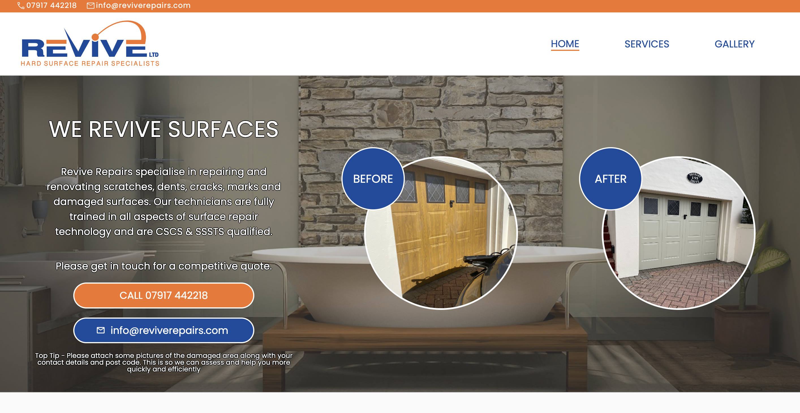

# revive-repairs

website: https://www.reviverepairs.com

## Important
This is the live version. Any changes to the main branch will trigger a deploy on Netlify – where it's hosted.

# Technologies
React •
mailtoui • 
bootstrap • 
Node JS
## Package manager
Uses npm as a package manager.
Run `npm start` to start the development server locally.

# Author
<h3>Robert Bish</h3>

